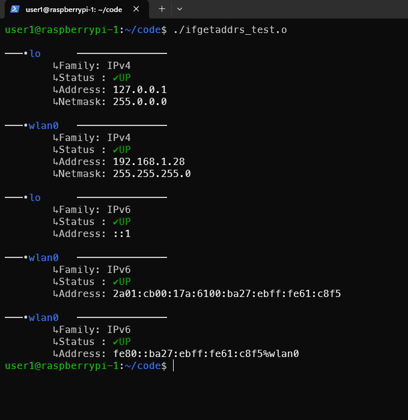

# ifnetlist

`ifnetlist` is a small Linux command-line tool written in C that displays
network interface information such as IPv4/IPv6 addresses, netmasks and
interface status.  
It is inspired by `ifconfig` and `ip addr`, and built using low-level Linux
networking APIs.

This project is mainly educational and focuses on system programming,
networking, and terminal UX.

---

## Features

- Lists all network interfaces
- Displays IPv4 and IPv6 addresses
- Shows interface status (UP / DOWN)
- Displays netmask information
- Clean, readable terminal output
- Uses `getifaddrs()` and `getnameinfo()`

---

## Example Output

```text
───•lo      ───────────────
        ↳Family: IPv4
        ↳Status : ✔UP
        ↳Address: 127.0.0.1
        ↳Netmask: 255.0.0.0

───•wlan0   ───────────────
        ↳Family: IPv4
        ↳Status : ✔UP
        ↳Address: 192.168.1.28
        ↳Netmask: 255.255.255.0

───•lo      ───────────────
        ↳Family: IPv6
        ↳Status : ✔UP
        ↳Address: ::1

───•wlan0   ───────────────
        ↳Family: IPv6
        ↳Status : ✔UP
        ↳Address: 2a01:cb00:17a:6100:ba27:ebff:fe61:c8f5

───•wlan0   ───────────────
        ↳Family: IPv6
        ↳Status : ✔UP
        ↳Address: fe80::ba27:ebff:fe61:c8f5%wlan0
```
  
  ## Compilation

```text
  gcc -Wall -Wextra -o my_ifconfig main.c
```
No external libraries are required.

  ## Usage

```text
  ./my_ifconfig
```

  ## Run with standard user privileges.


- Technical Details

- Language: C

- Platform: Linux

- APIs used:

    - getifaddrs()

    - getnameinfo()

    - AF_INET, AF_INET6

    - POSIX / Linux networking headers

    Purpose

  ## This project was created to:

- Practice Linux system programming

- Understand network interfaces and address families

- Build a clean terminal UX for low-level tools

## Screenshot

